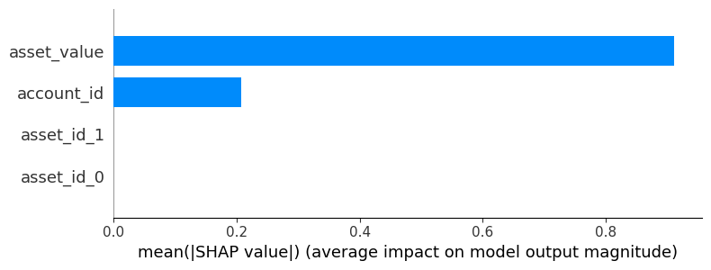
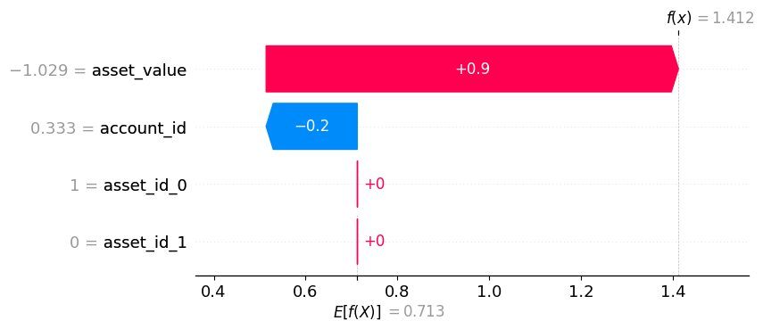

# df-data-quality-ml

This application implements an ML model to detect anomalies in the datasets. ML model is a Gradient Boosting Decision Tree Classifier. It tries to classify the data records as current vs prior day data. Anomalies are detected when the model classifies any record as current day data (i.e. they look different from the prior day snapshots of the same dataset).
Model output is explained using SHAP values and plots. Application can be invoked using CLI or REST API end points. This allows the app to be integrated into a larger data ingestion / distribution framework.

### Define the environment variables

Create a .env file with the following variables.

```
ENV=dev
APP_ROOT_DIR=

```

### Install

- **Install via Makefile and pip**:
  ```sh
    make install
  ```

### Usage Examples

- **Apply DQ rules on a dataset via CLI**:
  ```sh
    dqml-app-cli detect-anomalies --dataset_id "dataset_2"
  ```

- **Apply DQ rules on a dataset via CLI with cycle date override**:
  ```sh
    dqml-app-cli detect-anomalies --dataset_id "dataset_2" --cycle_date "2024-12-26"
  ```

- **Apply DQ rules on a dataset via API**:
  ##### Start the API server
  ```sh
    dqml-app-api
  ```
  ##### Invoke the API endpoint
  ```sh
    https://<host name with port number>/detect-anomalies/?dataset_id=<value>
    https://<host name with port number>/detect-anomalies/?dataset_id=<value>&cycle_date=<value>

    /detect-anomalies/?dataset_id=dataset_2
    /detect-anomalies/?dataset_id=dataset_2&cycle_date=2024-12-26
  ```
  ##### Invoke the API from Swagger Docs interface
  ```sh
    https://<host name with port number>/docs

  ```

### Sample Input

  ##### Dataset (acct_positions_20241226.csv)
```
effective_date,account_id,asset_id,asset_value
2024-12-26,ACC1,1,-35000
2024-12-26,ACC1,2,-15000
2024-12-26,ACC2,2,10000
2024-12-26,ACC4,1,-5000
2024-12-26,ACC5,1,-5000
2024-12-26,ACC6,1,-5000
2024-12-26,ACC7,1,-5000
2024-12-26,ACC8,1,-5000
2024-12-26,ACC9,1,-5000
```

  ##### Dataset (acct_positions_20241224.csv)
```
effective_date,account_id,asset_id,asset_value
2024-12-24,ACC1,1,34000
2024-12-24,ACC1,2,14500
2024-12-24,ACC2,2,13000
2024-12-24,ACC3,1,10000
```

  ##### Dataset (acct_positions_20241130.csv)
```
effective_date,account_id,asset_id,asset_value
2024-11-29,ACC1,1,30000
2024-11-29,ACC2,2,15000
```

### API Data (simulated)
These are metadata that would be captured via the DQ application UI and stored in a database.

  ##### Datasets 
```
{
  "datasets": [
    {
      "dataset_id": "dataset_2",
      "dataset_type": "local delim file",
      "file_delim": ",",
      "file_path": "APP_DATA_IN_DIR/acct_positions_yyyymmdd.csv",
      "schedule_id": "schedule_2",
      "recon_file_delim": "|",
      "recon_file_path": "APP_DATA_IN_DIR/acct_positions_yyyymmdd.recon"
    },
    {
      "dataset_id": "dataset_14",
      "dataset_type": "local delim file",
      "file_delim": "|",
      "file_path": "APP_DATA_OUT_DIR/asset_value_agg_yyyymmdd.dat",
      "schedule_id": "schedule_2",
      "recon_file_delim": null,
      "recon_file_path": null
    }
  ]
}

```

  ##### Dataset DQ Model Parameters

```
{
    "dq_model_parms": [
      {
        "dataset_id": "dataset_2",
        "model_parameters": {
          "features": [
            {
              "column": "account_id",
              "variable_type": "category",
              "variable_sub_type": "nominal",
              "encoding": "frequency"
            },
            {
              "column": "asset_id",
              "variable_type": "category",
              "variable_sub_type": "nominal",
              "encoding": "one hot"
            },
            {
              "column": "asset_value",
              "variable_type": "numeric",
              "variable_sub_type": "float",
              "encoding": "numeric"
            }
          ],
          "hist_data_snapshots": [
            {
              "snapshot": "t-1d"
            },
            {
              "snapshot": "lme"
            }
          ],
          "sample_size": 10000
        } 
      },
      {
        "dataset_id": "dataset_14",
        "model_parameters": {
          "features": [
            {
              "column": "asset_type",
              "variable_type": "category",
              "variable_sub_type": "nominal",
              "encoding": "one hot"
            },
            {
              "column": "asset_value_agg",
              "variable_type": "numeric",
              "variable_sub_type": "float",
              "encoding": "numeric"
            }
          ],
          "hist_data_snapshots": [
            {
              "snapshot": "t-1d"
            }
          ],
          "sample_size": 10000
        } 
      } 
    ]
  }

```

### Sample Output 

#### Raw data
```
  effective_date account_id asset_id asset_value
0     2024-12-26       ACC1        1      -35000
1     2024-12-26       ACC1        2      -15000
2     2024-12-26       ACC2        2       10000
3     2024-12-26       ACC4        1       -5000
4     2024-12-26       ACC5        1       -5000
5     2024-12-26       ACC6        1       -5000
6     2024-12-26       ACC7        1       -5000
7     2024-12-26       ACC8        1       -5000
8     2024-12-26       ACC9        1       -5000
  effective_date account_id asset_id asset_value
0     2024-12-24       ACC1        1       34000
1     2024-12-24       ACC1        2       14500
2     2024-12-24       ACC2        2       13000
3     2024-12-24       ACC3        1       10000
4     2024-11-29       ACC1        1       30000
5     2024-11-29       ACC2        2       15000
```

#### Features
There are 15 samples/observations and 4 features in the data.

Features are encoded into numeric values.
account_id - Frequency encoding
asset_id - One hot encoding
asset_value - Normalized by diving by max asset value

```
    account_id  asset_id_0  asset_id_1  asset_value
0     0.333333         1.0         0.0    -1.029412
1     0.333333         0.0         1.0    -0.441176
2     0.200000         0.0         1.0     0.294118
3     0.066667         1.0         0.0    -0.147059
4     0.066667         1.0         0.0    -0.147059
5     0.066667         1.0         0.0    -0.147059
6     0.066667         1.0         0.0    -0.147059
7     0.066667         1.0         0.0    -0.147059
8     0.066667         1.0         0.0    -0.147059
9     0.333333         1.0         0.0     1.000000
10    0.333333         0.0         1.0     0.426471
11    0.200000         0.0         1.0     0.382353
12    0.066667         1.0         0.0     0.294118
13    0.333333         1.0         0.0     0.882353
14    0.200000         0.0         1.0     0.441176
```

#### Target Labels
'1' - Current day data

'0' - Prior day data

```
[1, 1, 1, 1, 1, 1, 1, 1, 1, 0, 0, 0, 0, 0, 0]
```

#### Data (Features) for prediction
Test data for explainer

```
   account_id  asset_id_0  asset_id_1  asset_value
0    0.333333         1.0         0.0    -1.029412
1    0.333333         0.0         1.0    -0.441176
2    0.200000         0.0         1.0     0.294118
3    0.066667         1.0         0.0    -0.147059
4    0.066667         1.0         0.0    -0.147059
5    0.066667         1.0         0.0    -0.147059
6    0.066667         1.0         0.0    -0.147059
7    0.066667         1.0         0.0    -0.147059
8    0.066667         1.0         0.0    -0.147059
```

#### SHAP values
These SHAP values are output by a Tree Explainer. 
Each column represent a feature. There are 4 features.

```
[[-0.19850235  0.          0.          0.8979624 ]
 [-0.19850235  0.          0.          0.8979624 ]
 [-0.19850235  0.          0.         -1.0153805 ]
 [ 0.21120496  0.          0.          0.8979624 ]
 [ 0.21120496  0.          0.          0.8979624 ]
 [ 0.21120496  0.          0.          0.8979624 ]
 [ 0.21120496  0.          0.          0.8979624 ]
 [ 0.21120496  0.          0.          0.8979624 ]
 [ 0.21120496  0.          0.          0.8979624 ]]
```

#### SHAP value plots

##### Summary Plot (All Samples)



"feature_name": "asset_value",

"mean_shap_value": 0.9110089540481567

"feature_name": "account_id",

"mean_shap_value": 0.20697076618671417


##### Waterfall Plot (1 Sample) 



"feature_name": "asset_value",

"feature_value": -1.02941176

"shap_value": 0.8979624

"feature_name": "account_id",

"feature_value": 0.33333333

"shap_value": -0.19850235

"base_value": 0.7126187

"predicted_value": 1.412 

Calculation:

predicted_value = base_value + shap_value for asset_value + shap_value for account_id 

predicted_value = 0.7126187 +0.8979624 -0.19850235 = 1.41207875

Note: Baseline value is calculated by SHAP assuming the features do not contribute to the prediction.

#### Feature scores
Feature importance scores are the average (mean) of absolute SHAP values for the feature/column.

```
{
  "results": [
    {
      "feature_name": "asset_value",
      "feature_importance": 0.9110089540481567
    },
    {
      "feature_name": "account_id",
      "feature_importance": 0.20697076618671417
    },
    {
      "feature_name": "asset_id_0",
      "feature_importance": 0.0
    },
    {
      "feature_name": "asset_id_1",
      "feature_importance": 0.0
    }
  ]
}
```

#### Conclusion
Feature scores indicate that the columns asset_value and asset_id are anomalies. 
It is evident from the 2024-12-26 data that these 2 columns' have abnormal data. 
